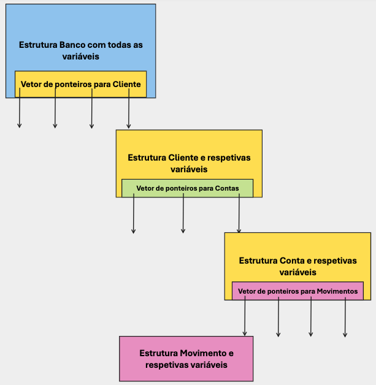

# Projeto Sistema de Gestão Bancária 

- [Projeto Sistema de Gestão Bancária](#projeto-sistema-de-gestão-bancária)
  - [Enquadramento](#enquadramento)
  - [Modelo de Dados](#modelo-de-dados)
    - [Movimento bancário](#movimento-bancário)
    - [Conta Bancária](#conta-bancária)
    - [Cliente](#cliente)
    - [Banco](#banco)
    - [Exemplo de modelo de dados](#exemplo-de-modelo-de-dados)
  - [Funcionalidades a implementar](#funcionalidades-a-implementar)
  - [Menus e Especificação das Funcionalidades](#menus-e-especificação-das-funcionalidades)
    - [Entradas do Menú Principal](#entradas-do-menú-principal)
    - [Entradas do Menu Clientes](#entradas-do-menu-clientes)
    - [Entradas do Menu Contas](#entradas-do-menu-contas)
    - [Entradas do Menú Movimentos](#entradas-do-menú-movimentos)
  - [Estrutura de Ficheiros fornecidos](#estrutura-de-ficheiros-fornecidos)
  - [Avaliação e data de entrega](#avaliação-e-data-de-entrega)
  - [Testes à aplicação](#testes-à-aplicação)
    - [Descrição dos Testes](#descrição-dos-testes)
    - [Execução dos testes](#execução-dos-testes)
  - [Boas Práticas](#boas-práticas)
    - [Compilação](#compilação)
    - [Formatação](#formatação)
    - [Comentários](#comentários)
    - [Organização do código](#organização-do-código)
    - [Constantes](#constantes)
    - [Exemplo de boas práticas nos comentários](#exemplo-de-boas-práticas-nos-comentários)


## Enquadramento
Entende-se por Sistema de Gestão Bancária sistemas que visam implementar soluções de modo a automatizar/apoiar na realização de tarefas das entidades ligadas ao setor da banca.

Neste projeto final da Unidade Curricular, pretende-se criar uma aplicação que possa, de uma forma muito limitada gerir uma pequena instituição bancária.

## Modelo de Dados
Após uma análise sobre as necessidade de informação da instituição, bem como um estudo sobre os processo a automatizar, foi identificado o seguinte modelo de dados/processos:

### Movimento bancário
Todos os movimentos/Operações bancárias devem ser registados. Para efeito do programa, cada conta deve armazenar pelo menos 100 movimentos financeiros (óbvio que numa situação real estaríamos a falar de um valor diferente). Cada movimento é identificado por:
- id: Um número inteiro (int) gerado pela aplicação, sendo que o primeiro movimento possuirá o `id=1` , o segundo o `id=2` e daí em diante segue a mesma norma;
- tipo de movimento: Pode se um de três `DEPÓSITO ; LEVANTAMENTO ; TRANSFERÊNCIA`;
- valor: Número real que quantifica o movimento. Deverá ser um valor negativo caso se retire dinheiro da conta e positivo se estamos a adicionar. O somatório dos valores de todas as transferências tem que ser igual ao saldo.

**Conceitos importantes no âmbito deste projeto:** 
- Entende-se por depósito a ação do cliente em adicionar dinheiro à sua conta bancária
- Entende-se por levantamento a ação do cliente em subtrair dinheiro à sua conta bancária
- Transferência é o processo de movimentar capital entre contas. Por simplificação, neste projeto, as transferências são só efetuadas entre contas do mesmo banco (podendo ser, ou não, pertencentes ao mesmo cliente), sendo que para cada transferência devem ser criados dois registos de movimento bancário, um positivo na conta de destino e outro negativo na conta de origem.

### Conta Bancária
Entende-se por Conta Bancária como um produto colocado pelo Banco à disposição do cliente, onde este pode depositar, levantar, ou transferir dinheiro. Na nosso instituição bancária não está autorizado que os clientes possuam o seu saldo negativo, pelo que qualquer operação de débito **nunca poderá ser autorizada** se daí resultar um saldo negativo. Por outro lado, para simplificar a aplicação, cada conta bancária só pode pertencer a um titular, podendo este efetuar todas as operações, sobre a conta, disponíveis na aplicação. Só o titular da conta está autorizado a efetuar operações sobre a conta.

Cada Conta bancária possuirá os seguintes atributos:
- Saldo (double)
- Código de Identificação da Conta: (array de caracteres - string) Não existem números de conta repetidos. O código de identificação da conta possuirá exatamente 3 caracteres, sendo composto por literais e algarismos.

### Cliente
Um cliente é uma pessoa que, através de um contrato com o banco, pode aceder a um conjunto de serviços disponíveis na Instituição Bancária. Por simplificação do projeto um cliente só pode possuir até o máximo de 3 contas bancárias. Cada cliente é identificado pelo seguinte conjunto de atributos:
- Id de cliente: inteiro que deverá se gerado automáticamente pela aplicação, de forma sequencial, sendo que o primeiro cliente possuirá o `id=1`, o segundo `id=2`, etc. Caso seja removido um cliente, esse número não voltará a ser atribuído, mesmo que o mesmo cliente se registe novamente.
- Nome: Máximo de 100 caracteres;
- Posição integrada: Valor real (double) que possui o saldo integrado de todas as contas do cliente. Mesmo que o saldo integrado do cliente seja positivo, não é permitido efetuar operações que deixem uma ou várias contas a descoberto (com saldo negativo).
- nif: String de exatamente 9 dígitos, não podendo haver clientes com o mesmo nif. Um cliente que deixe, a determinado momento, de ser cliente, pode voltar a ser novamente cliente

> **Importante**: No seu modelo de dados, deve considerar, para cada cliente, algumas variaveis que permitam responder facilmente às seguintes questões:
> - Quantas contas o cliente possui no momento?
> - Qual o valor total de dinheiro que o cliente possui em todas as suas contas?

### Banco
O banco é identificado pelo nome "ATEC BANK". Além disse o banco deve possuir:
- Até um máximo de 20 clientes, devendo esta capacidade, em futuros updates do software, poder ser facilmente expandido;
- Deverá ser facilmente acessível o valor global monetário armazenado no nosso banco 

> **Importante:**: No seu modelo de dados, a estrutura que representa o banco pode conter outras variáveis para guardar, por exemplo, o saldo total em cofre (somatório do saldo de todas as contas), o número total de clientes do banco e o numero total de contas existentes. Estes dados irão apresentados em resposta a alguns pedidos.

### Exemplo de modelo de dados



## Funcionalidades a implementar
A nossa aplicação terá que implementar um conjunto de funcionalidades, nomeadamente:
- Inserir Cliente
- Listar Clientes
- Mostrar Cliente
- Apagar Cliente
- Procurar Cliente
- Criar Conta Bancária
- Listar Contas de Cliente
- Mostrar Conta de Cliente
- Depositar Dinheiro
- Levantar Dinheiro
- Efetuar Transferência
- Informação do Banco

## Menus e Especificação das Funcionalidades

### Entradas do Menú Principal
1. **Menu Clientes**: Acesso ao menu clientes. Funcionalidade já implementada
2. **Menu Contas**: Acesso ao menu Contas. Funcionalidade já implementada
3. **Menu Movimentos**: Acesso ao    menu movimentos das contas. Funcionalidade já implementada
4. **Informação do Banco**: Deve apresentar Informação sobre o banco. Nomeadamente o número de clientes total, o número de contas total, o valor total do dinheiro existentes no banco. Esta informação deve ser impressa no ecrã invocando a macro `SHOW_BANK_INFO(NOME,NUM_CLIENTES,NUM_CONTAS,SALDO_TOTAL)` presente em sgb.h. Exemplo do output:
```text
####  ATEC Bank  ####
Clientes: 5
Contas: 8
Valor em Cofre: 123.40 €
``` 
9. **Saír da aplicação**: Já implementado

### Entradas do Menu Clientes

1. **Inserir Cliente**: Para inserir um cliente deve solicitar, por esta ordem, o nome (string) e nif do cliente (String). Para estes pedidos deve utilizar a função `void pedirString(char *dest, char *msg, int max_char)` e as macros `ASK_NAME` e `ASK_NIF` declaradas no ficheiro sgb.h. Além destes campos, não se esqueça que a aplicação tem que gerar um inteiro como id do cliente.Esta operação retorna uma das seguintes mensagens:
   - `Cliente <id>, <nome>, inserido com sucesso`: Quando o cliente é introduzido com sucesso. Para o efeito eve ser utilizada a macro `INSERT_CLIENT_SUCESS(ID,NAME)`
   - `Erro! Não há vagas para novos clientes`: A mostrar quando não for possivel adicionar mais clientes ao banco. Deve ser utilizada a macro `INSERT_CLIENT_ERROR_BANK_OVERLOAD`. Neste caso, não deve ser solicitado o nome e o nif do cliente. 
   > **Importante:** Ou seja o teste é feito assim que o user seleciona `Inserir Cliente` e antes de solicitar os restantes dados. Caso o banco não possua capacidade para inserir novos clientes o `<nome>` e `<nif>` **não são solicitados**
   - `Erro! Cliente com <nif> já existe!`: A apresentar se o nif do Cliente já existe como cliente. Para o efeito deve ser utilizada a macro `INSERT_CLIENT_ERROR_ALREADY_EXISTS(NIF)` 

2. **Listar Clientes**: Lista todos os clientes existentes no banco. Os clientes devem ser listados por Ordem Alfabética do seu nome. A chamada desta funcionalidade deve retornar uma de duas respostas:
   - `Erro! Não existem clientes no banco`, através da macro `NO_CLIENTS_ERROR`
   - Em caso de sucesso deve usar-se a macro `LIST_USERS_HEADER(TOTAL_CLIENTS)` para o cabeçalho e a macro `LIST_USERS_ITEM(ID,NIF,NAME,NUM_ACCOUNTS)` por cada cliente existentes. A macro apresenta por cliente o seguinte formato de escrita `<id> - <nif> - <nome> - Contas: <num_contas_cliente> - <saldoIntegrado>`.Veja um possível exemplo:
   > **Importante**: Assume-se que nunca haverá dois clientes distintos com o mesmo nome

```text
####### 3 Clientes no Banco #######
3 - 111111111 - Aníbal o Grande - Contas: 2 - 334.45€
1 - 666666666 - Bento o Bárbaro - Contas: 0 - 0.00€
2 - 111999111 - Xavier - Contas: 3 - 234.90 €
```
1. **Mostrar Cliente**: Neste caso deve ser solicitado o id do cliente através da string definida na macro `ASK_CLIENT_ID` e deve ser usada a biblioteca ui para solicitar e receber o valor. Uma, de três, mensagens devem ser retornadas, consoante o caso:
   - `Erro! Não existem clientes no banco`, através da macro `NO_CLIENTS_ERROR`
   - `Erro! O cliente com o ID <id> não existe`, através da macro `NO_SUCH_CLIENT_ERROR(ID)`
   - Para mostrar a informação detalhada de um cliente devem ser usadas 3 macros:
     - Informação do cliente através da Macro `CLIENT_INFO(ID,NIF,NAME,NUM_ACCOUNTS,TOTAL_VALUE)`
     - De seguida, por cada conta, mostrar (As contas devem ser mostradas por ordem alfabética do seu ID):
       - Informação da conta através da macro `CLIENT_INFO_ACCOUNTS(ID_CONTA,SALDO)`. As contas devem ser mostradas por ordem alfabética do `<num_conta>`
       - Movimentos da Conta através da macro (deve-se invocar a macro uma vez por cada movimento). Os movimentos devem ser apresentados por ordem decrescente do seu ID`CLIENT_INFO_MOVEMENTS(ID_MOV,TIPO,VALOR)`
        ```text
        ###### INFO CLIENTE: 5 ######
        NOME: 123456789
        NIF: Vitor Manuel
        NUM. CONTAS: 2
        POSIÇÃO INTEGRADA: 17.89 €
          # Conta Num: 1AD - Saldo: 2.40 €
            -> Movimento 3 - DEPÓSITO : 34.00 €
            -> Movimento 2 - LEVANTAMENTO : -20.10 €
            -> Movimento 1 - TRANSFERÊNCIA : -11.50 €
          # Conta Num: B4D - Saldo: 15.49 €
            -> Movimento 2 - DEPÒSITO : 10.05 €
            -> Movimento 1 - DEPÒSITO : 5.44 €
        ```
2. **Apagar Cliente**: Deve ser solicitado o id do cliente através da string definida na macro `ASK_CLIENT_ID`. Uma de 3 mensagens deve ser retornada:
   - `Erro! Não existem clientes no banco`, através da macro `NO_CLIENTS_ERROR`. Neste caso não chega a ser solicitado o id do cliente.
   - `Erro! O cliente com o ID <id> não existe`, através da macro `NO_SUCH_CLIENT_ERROR(ID)`
   - Caso exista, deve ser apresentada a seguinte mensagem: `Cliente <id> apagado com sucesso`, utilizando-se para o efeito a macro `CLIENT_DELETE_OK(ID)`. De notar que quando um cliente é apagado, supões-se que o mesmo fechou a posição com o banco, ou seja fechou todas as suas contas e levantou todo o dinheiro. Caso o banco estivesse cheio, irá a partir desse momento haver lugar para mais um cliente.
3. **Procurar Clientes**: Deve ser solicitado um termo de pesquisa (string) através da macro `ASK_FIND_TERM`. Esse termo de pesquisa deve ser procurado em todos os nomes de cliente. Uma de 3 mensagens deve ser apresentada ao utilizador:
   - `Erro! Não existem clientes no banco`, através da macro `NO_CLIENTS_ERROR`. Neste caso não chega a ser solicitado o termos de pesquisa.
   - `Não Foram encontrados clientes através da Pesquisa: <termo_pesquisa>`. Para escrever esta mensagem deve utilizar a macro `NO_CLIENTS_FOUND_ERROR(TERMO)`
   - Em caso de sucesso deve usar-se a macro `LIST_USERS_ITEM(ID,NIF,NAME,NUM_ACCOUNTS)` por cada cliente encontrado, os quais são apresentados por ordem alfabetica do seu nome. A macro apresenta por cliente o seguinte formato de escrita `<id> - <nif> - <nome> - Contas: <num_contas_cliente> - <saldoIntegrado>`. No final deve ser invocada a macro de rodapé `CLIENTS_LOOKUP_FOOTER(NUM_CLIENTS_FOUND,TERMO)`. Veja um possível exemplo:
    ```text
    3 - 111111111 - Almiro do Castro - Contas: 2 - 334.45€
    2 - 111999111 - Almerinda Maria - Contas: 3 - 234.90 €
    # Foram encontrados 2 clientes com o termo: alm
    ```
4. **Menu Principal**: Retorna ao Menu Principal. Já implementado 

### Entradas do Menu Contas
1. **Criar Conta**: É solicitado o id do cliente, para o qual se pretende abrir a conta (`ASK_CLIENT_ID`) e o número da conta (O número da conta não é gerado, pelo que é solicitado) através da macro `ASK_ACCOUNT_ID`. É retornado um dos seguintes outputs, consoante o caso:
   - `Erro! Não existem clientes no banco`, através da macro `NO_CLIENTS_ERROR`. Neste caso o erro é apresentado assim que seja invocada a função, não sendo pedidos o id do cliente e o numero da conta.
   - `Erro! O cliente com o ID <id> não existe` escrito através da macro `NO_SUCH_CLIENT_ERROR(ID)`. Neste caso o erro é escrito após ser dado o id do cliente, já não sendo solicitado o número da conta.
   - `Erro! O cliente ID <id> já não pode possuir mais contas` através da macro `NEW_ACCOUNT_ERROR_CLIENT_OVRELOADED(ID)`. Neste caso, porque não é possível criar, não chega a ser pedido o número da conta.
   - `Conta <id_conta> criada com sucesso para o cliente <id>`, através a macro `ACCOUNT_CREATION_SUCESS(ID_ACCOUNT,ID_CLIENT)`
2. **Listar Contas Cliente**: É solicitado o id do cliente, para o qual se pretende listar as contas (`ASK_CLIENT_ID`). É retornado um dos seguintes outputs, consoante o caso:
   - `Erro! Não existem clientes no banco`, através da macro `NO_CLIENTS_ERROR`
   - `Erro! O cliente com o ID <id> não existe` escrito através da macro `NO_SUCH_CLIENT_ERROR(ID)`
   - `O cliente <id> não possui contas` através da macro `CLIENT_DONT_HAVE_ACCOUNTS(ID)`
   - Caso hajam contas deve ser apresentada a header, através da macro `LIST_ACCOUNTS_HEADER(ID_CLIENT,NAME,TOTAL_VALUE)` e por cada conta, apresentar através da macro `CLIENT_INFO_ACCOUNTS(ID_CONTA,SALDO)`. Os movimentos da Conta deverão ser apresentados através da macro `CLIENT_INFO_MOVEMENTS(ID_MOV,TIPO,VALOR)`. Os movimentos devem ser apresentados por ordem decrescente do seu ID. As contas devem ser apresentadas (caso haja mais que uma) ordenadas alfabeticamente.
3. **Mostrar Conta Cliente**: É solicitado o id do cliente titular da conta (`ASK_CLIENT_ID`) e o número da conta (`ASK_ACCOUNT_ID `). Esta funcionalidade deve produzir um dos seguintes outputs:
   - `Erro! Não existem clientes no banco`, através da macro `NO_CLIENTS_ERROR`
   - `Erro! O cliente com o ID <id> não existe` escrito através da macro `NO_SUCH_CLIENT_ERROR(ID)`
   - `O cliente <id> não possui contas` através da macro `CLIENT_DONT_HAVE_ACCOUNTS(ID)`
   - `"Erro! O cliente com o ID <id> não possuí a conta <id_conta>` escrito através da macro `NO_SUCH_ACCOUNT_ERROR(ID_CLIENT,ID_ACCOUNT)`.
    - Caso a conta exista deve ser efetuado o mesmo procedimento de listar contas. Primeiro o header header, através da macro `LIST_ACCOUNTS_HEADER(ID_CLIENT,NAME,TOTAL_VALUE)` e para a conta, apresentar através da macro `CLIENT_INFO_ACCOUNTS(ID_CONTA,SALDO)`. Os movimentos da Conta deverão ser apresentados através da macro `CLIENT_INFO_MOVEMENTS(ID_MOV,TIPO,VALOR)`. Os movimentos devem ser apresentados por ordem decrescente do seu ID.
4. **Fechar Conta**: É solicitado o id do cliente titular da conta (`ASK_CLIENT_ID`) e o número da conta (`ASK_ACCOUNT_ID `). Esta funcionalidade deve produzir um dos seguintes outputs:
   - `Erro! Não existem clientes no banco`, através da macro `NO_CLIENTS_ERROR`
   - `Erro! O cliente com o ID <id> não existe` escrito através da macro `NO_SUCH_CLIENT_ERROR(ID)`
   - `O cliente <id> não possui contas` através da macro `CLIENT_DONT_HAVE_ACCOUNTS(ID)`
   - `"Erro! O cliente com o ID <id> não possuí a conta <id_conta>` escrito através da macro `NO_SUCH_ACCOUNT_ERROR(ID_CLIENT,ID_ACCOUNT)`
   - Caso o cliente exista e a conta, esta é fechada, supondo-se que o dinheiro foi levantado. O Cliente ficará assim com mais uma slot livre para criar contas (no máximo de 3). Deve ser apresentada a mensagem `Conta <id_conta> pertencente ao cliente <id> fechada com sucesso`, utilizando-se para tal a macro `ACCOUNT_CLOSE_OK(ID_ACCOUNT,ID_CLIENT)`
5. **Menu Principal**: Volta ao menu Principal. Já implementado

### Entradas do Menú Movimentos
1. **Depositar Dinheiro**: É solicitado o id do cliente, onde se deve depositar o dinheiro (`ASK_CLIENT_ID`),  o número da conta (`ASK_ACCOUNT_ID `) e o valor a depositar através da macro `ASK_FOR_VALUE`. Esta funcionalidade deve produzir um dos seguintes outputs:
   - `Erro! Não existem clientes no banco`, através da macro `NO_CLIENTS_ERROR`. Caso não exista clientes no banco, deve ser de imediato escrito a mensagem de erro sem solicitar o ID do cliente ou o número da conta.
   - `Erro! O cliente com o ID <id> não existe` escrito através da macro `NO_SUCH_CLIENT_ERROR(ID)`. Só é pedido o número da conta caso o cliente exista. Se não existir apresenta o erro e sai da função, não solicitando o número da conta
   - `O cliente <id> não possui contas` através da macro `CLIENT_DONT_HAVE_ACCOUNTS(ID)`. Só é pedido o numero da canta caso o cliente tenha contas. Caso não tenha é apresentado o erro e sai da função.
   - `"Erro! O cliente com o ID <id> não possuí a conta <id_conta>` escrito através da macro `NO_SUCH_ACCOUNT_ERROR(ID_CLIENT,ID_ACCOUNT)`. Neste caso não deve ser solicitado o valor a depositar ao utilizador. 
    - Caso a conta exista deve ser efetuado o depósito, dando a seguinte mensagem de sucesso `Depósito de <valor> efetuado com sucesso na conta <id_conta>`, usando para o efeito a macro `DEPOSIT_OK(VALUE,ID_ACCOUNT)`
2. **Levantar Dinheiro**: É solicitado o id do cliente, de onde se pretende levantarr o dinheiro (`ASK_CLIENT_ID`),  o número da conta (`ASK_ACCOUNT_ID `) e o valor a levantar através da macro `ASK_FOR_VALUE`. Esta funcionalidade deve produzir um dos seguintes outputs:
   - `Erro! Não existem clientes no banco`, através da macro `NO_CLIENTS_ERROR`. Caso não exista clientes no banco, deve ser de imediato escrito a mensagem de erro sem solicitar o ID do cliente ou o número da conta.
   - `Erro! O cliente com o ID <id> não existe` escrito através da macro `NO_SUCH_CLIENT_ERROR(ID)`. Só é pedido o número da conta caso o cliente exista. Se não existir apresenta o erro e sai da função, não solicitando o número da conta
   - `O cliente <id> não possui contas` através da macro `CLIENT_DONT_HAVE_ACCOUNTS(ID)`. Só é pedido o numero da canta caso o cliente tenha contas. Caso não tenha é apresentado o erro e sai da função.
   - `"Erro! O cliente com o ID <id> não possuí a conta <id_conta>` escrito através da macro `NO_SUCH_ACCOUNT_ERROR(ID_CLIENT,ID_ACCOUNT)`. É apresentado o erro e não é solicitado o valor ao utilizador.
   - `O cliente <id> não possui saldo suficiente na conta <id_conta> para a operação solicitada`, através da macro `WITHDRAWAL_ERROR_NO_FUNDS(ID_CLIENT,ID_ACCOUNT)`
   - Caso a conta exista e haja saldo, deve ser efetuado o levantamento, dando a seguinte mensagem de sucesso `Levantamento de <valor> efetuado com sucesso da conta <id_conta>`, usando para o efeito a macro `WITHDRAWAL_OK(VALUE,ID_ACCOUNT)`
3. **Efetuar Transferência**: Como já dito acima, só é possível efetuar transferências entre contas do mesmo banco. Para tal devem ser feitos os seguintes procedimentos, por esta ordem:
   1. Pedir os dados (cliente, conta e valor) como se fosse fazer um levantamento (ver ponto acima). Caso algum erro aconteça, apresenta o erro e sai do procedimento;
   2. Caso procedimento 1 tenha sucesso, solicitar dados (cliente e conta) como se efetuou para depositar. Caso haja erro, apresenta o erro e sai do procedimento
   3. Caso os dois pontos tenham corrido sem erros, efetua-se a transferência descontando o saldo da conta de origem, aumentando na conta de destino, e registando (em ambas as contas) um movimento de "TRANSFERÊNCIA". Neste caso apresenta-se a mensagem `Transferência de <valor> € efetuada com sucesso. <ID_conta_Origem> -> <ID_conta_Destino>`, através da macro `TRANSFER_OK(VALUE,ID_ORIGIN,ID_DESTINATION)`
4. **Menu Principal**: Volta ao menu Principal. Já implementado

## Estrutura de Ficheiros fornecidos
- User Interface - Ficheiros ui.c e ui.h **Proibido Alterar estes Ficheiros**
- Main - ficheiro main.c **Só pode ser alterado a zona do código marcado com TODO**
- Biblioteca gestão bancária - sgb.c e sgb.h 

## Avaliação e data de entrega
- 12 valores: Testes automáticos (O programa se apresentar erros de compilação não efetua os testes pelo que será atribuído nota zero)
- 8 valores: qualidade do código
  - Abstração
  - Comentários
  - Organização do Código
  - Técnica
  - Erros ou Warnings de compilação (a existência de erros ou warnings penaliza a avaliação)
  - Erros de memória (teste com valgrind)
- Consoante a apresentação do trabalho, caso o professor considere que um ou mais alunos desconhecem o projeto (subentendendo-se que não participaram na sua elaboração) o professor pode retirar até 5 valores à nota individual do aluno
- Todos os trabalhos irão ser passados através de uma ferramente de plágio, para detetar eventuais cópias. Caso tal se verifique a nota a atribuir ao trabalho é zero. Saiba mais em [MOSS - Universidade de Standford](https://theory.stanford.edu/~aiken/moss/)

O projeto deve ser entregue através de upload no servidor Git em dia e hora a definir entre a turma e o professor. O Acesso ao servidor é fechado após essa hora.

> **Importante:** Só são avaliados trabalhos entregues pelo GIT.
>
> Caso o professor considere (problemas no servidor, etc) poderá ser extendido o prazo de entrega

## Testes à aplicação

### Descrição dos Testes
Os testes à aplicação são efetuados através de um conjunto de testes que se encontram na pasta testes. Nessa pasta podem ser encontrados 2 tipos de ficheiro:
- **Ficheiros <nome>.in** que são os ficheiros com os comandos de entrada para a aplicação
- **Ficheiros <nome>.solution** que são os ficheiros com o output correto que a aplicação deverá fornecer. 
  
Deste modo para cada ficheiro de entrada(in) existe um ficheiro com a solução certa (solution). Ao testar a vossa aplicação é assim possível, mediante um ficheiro de entrada com um conjunto de comandos (in) gravar a saída do vosso programa (na pasta studentOut) e comparar essa saída com a saída correta (.solution) Caso Não haja diferenças entre a saída do vosso programa e a saída esperada, assume-se que o teste tem sucesso e que a funcionalidade está implementada.

Aconselha-se que o desenvolvimento da aplicação se faça segundo a mesma ordem da numeração dos testes, a qual se apresenta abaixo (não é obrigatório). Os testes estão numerados segundo a seguinte especificação `t<FF>_<XX>.in`, onde FF é a funcionalidade a testar e XX o número do teste que testa essa funcionalidade (existe mais que um teste para testar cada funcionalidade). Por outro lado, testes posteriores pressupõem que as funcionalidades anteriores estão implementadas. Por exemplo para Listar Clientes, é necessário Inserir clientes:
* t00_XX.in - Navegação entre menus e sair. Todos estes testes passam na versão inicial entregue aos alunos
* t01_XX.in - Inserir Cliente 
* t02_XX.in - Listar Cliente
* t03_XX.in - Criar Conta
* t04_XX.in - Listar Contas
* t05_XX.in - Depositar Dinheiro
* t06_XX.in - Levantar Dinheiro
* t07_XX.in - Transferir Dinheiro
* t08_XX.in - Mostrar Conta
* t09_XX.in - Fechar Conta
* t10_XX.in - Mostrar Cliente
* t11_XX.in - Apagar Cliente
* t12_XX.in - Procurar Cliente
* t13_XX.in - Info Banco
* t14_XX.in - Stress Test (Testes longos e globais, mais completos para testar integradamente funcionalidades). Só um é fornecido ao aluno. Outros testes gerais irão ser utilizados para avaliação (em complemento dos testes fornecidos ao aluno). Após a entrega os testes complementares serão fornecidos

### Execução dos testes
Para a execução dos testes existem 2 scripts que automatizam o processo. O script `test_all.sh` e `test_func.sh`:
- O primeiro, `test_all.sh` é executado fazendo o comando `./test_all.sh` no terminal (Atenção que têm que a pasta de trabalho do terminal tem que ser a pasta onde está o script, ou seja na raiz do projeto). Este Script executa o make e testa, por ordem, todos os testes e vai escrevendo no ecrã o resultado do mesmo. No final executa o make clean. **Atenção que a compilação do programa deve correr sem erros para o script não abortar**
- O segundo, `test_func.sh`, testa só uma funcionalidade, conforme a lista apresentada acima. Para executar este Script deverá ser executado o comando `./test_func.sh txx`, onde xx é o número da funcionalidade a testar (t01 para inserir cliente, etc). Ao contrário do script all,, este script mostra no ecrã, quando o teste falha, qual a diferença entre a saída produzida pelo vosso programa e aquela que era esperada.

Uma boa abordagem poderá ser seguir esta ordem na implementação das funcionalidades. Veja abaixo um exemplo de cada script a funcionar.

**Script all**
```shell
./test_all.sh 
rm -rf *.o
rm -rf banco_app
gcc -Wall  -c -o main.o main.c
gcc -Wall  -c -o ui.o ui.c
gcc -Wall  -c -o sgb.o sgb.c
gcc -Wall  -o banco_app main.o ui.o sgb.o
OK:Programa corretamente compilado....
**********************************
******* TESTES AUTOMÁTICOS *******
**********************************
->Teste testes/t00_01.in:-> SUCESSO! 
->Teste testes/t00_02.in:-> SUCESSO! 
->Teste testes/t00_03.in:-> SUCESSO! 
->Teste testes/t01_01.in:-> SUCESSO! 
->Teste testes/t01_02.in:-> NÃO PASSOU. REVEJA O CÓDIGO! 
->Teste testes/t01_03.in:-> NÃO PASSOU. REVEJA O CÓDIGO! 
->Teste testes/t01_04.in:-> NÃO PASSOU. REVEJA O CÓDIGO! 
->Teste testes/t02_01.in:-> NÃO PASSOU. REVEJA O CÓDIGO! 
->Teste testes/t02_02.in:-> NÃO PASSOU. REVEJA O CÓDIGO! 
**********************************
**** Fim de Testes Automáticos ***
********** Testes OK: 4 **********
********* Testes NOK: 5 *********
**********************************
Lembre-se que estes testes não cobrem todos os casos
Deverá testar exaustivamente com outros testes!!!!
A efetuar make clean
rm -rf *.o
rm -rf banco_app
```
**Script Função**
```shell
./test_func.sh t00
rm -rf *.o
rm -rf banco_app
gcc -Wall  -c -o main.o main.c
gcc -Wall  -c -o ui.o ui.c
gcc -Wall  -c -o sgb.o sgb.c
gcc -Wall  -o banco_app main.o ui.o sgb.o
OK:Programa corretamente compilado....
**********************************
     TESTES Funcionalidade t00
**********************************
->Teste testes/t00_01.in:-> SUCESSO! 
->Teste testes/t00_02.in:-> SUCESSO! 
->Teste testes/t00_03.in:-> SUCESSO! 
**********************************
**** Fim de Testes Automáticos ***
         Testes OK: 3  
         Testes NOK: 0 
**********************************
Lembre-se que estes testes não cobrem todos os casos
Deverá testar exaustivamente com outros testes!!!!
A efetuar make clean
rm -rf *.o
rm -rf banco_app
```

## Boas Práticas
### Compilação

* O programa deve ser compilado usando o comando `make`.
* O compilador não deve apresentar erros ou avisos ("warnings").
* Recomenda-se usar a versão 7, ou superior, do compilador (consulte `gcc --version`).

### Formatação

* A formatação do código deve ser **consistente**. Recomenda-se a utilização de um editor de texto com indentação automática.
* Abrir cada chaveta na mesma linha do cabeçalho da função **ou** na linha a seguir, alinhada com o cabeçalho.
Fechar cada chaveta numa linha nova, também alinhada com o cabeçalho. O mesmo aplica-se às chavetas associadas aos comandos `for`, `if`, `switch`, e `while`.

### Comentários

* O código deve que ser adequadamente comentado. Comentários em excesso devem ser evitados.
Por exemplo, não é necessário comentar sobre uma variável que representa um contador de um ciclo.
* Cada ficheiro deve ter um comentário, no início, com uma descrição sucinta e o(s) nome(s) do(s) autor(es).
* Cada função deve ter um comentário, antes do cabeçalho, com uma descrição sucinta.
* Cada variável global e/ou estática deve ter um comentário com uma descrição sucinta. O comentário pode ser colocado na mesma linha da declaração da variável, ou na linha antes.

### Organização do código

* Não deve haver repetição de código (código repetido deveria ser colocado numa função).
* Evite funções demasiado grandes (e pouco legíveis).

### Constantes

* Constantes (números, strings) nunca devem que aparecer directamente no código. Usem a directiva `#define` no início dos ficheiros ou num ficheiro `.h` separado.

### Exemplo de boas práticas nos comentários

```c
/*
 * File:  ex.c
 * Author:  xpto
 * Description: A program exemplifying the use of comments and formatting in C.
*/
#include<stdio.h>


#define SZ 100 //The maximum number of values stored.


int vals[SZ];//Array of values. 
/* The number of values stored. */
int count;

/**
 * Adds val to array
 * @param val Value to add
 * @return int incremented count
*/
int add(int val) {
    vals[count] = val;
    return ++count;
}

/* Reads n values from stdin and inserts them into the vector vals. */
int main() {
    int n, v;
    scanf("%d", &n);
    while (n--) {
        scanf("%d", &v);
        add(v);
    }
    return 0;
}
```


